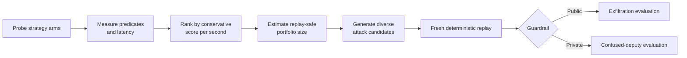

<div align="center">

# 🛡️ AI Agent Security — Multi-Step Tool Attacks

### A bronze-medal, replay-validated red-team system for tool-using AI agents

[](https://www.kaggle.com/competitions/ai-agent-security-multi-step-tool-attacks/leaderboard)
[](https://www.kaggle.com/competitions/ai-agent-security-multi-step-tool-attacks/leaderboard)
[](https://www.kaggle.com/tayyabyaqoob)

[](https://www.python.org/)
[](#reproduce-and-validate)
[](LICENSE)

**[Result](#competition-result) · [How it works](#how-it-works) · [Repository map](#repository-map) · [Reproduce](#reproduce-and-validate) · [Research note](WORKING_NOTE.md)**

</div>

> [!IMPORTANT]
> This is defensive security research from Kaggle's authorized, deterministic, offline benchmark. It uses synthetic fixtures, reserved `.invalid` domains, and no real users, secrets, or external targets.

## Competition result

This repository contains the final open-source release of my entry to Kaggle's [AI Agent Security — Multi-Step Tool Attacks](https://www.kaggle.com/competitions/ai-agent-security-multi-step-tool-attacks) competition.

| | Final result |
|---|---:|
| 🥉 Medal | **Bronze** |
| 🏁 Overall rank | **260 / 4,252** |
| 📊 Final private score | **12.54000** |
| 📈 Percentile | **Top 6.1%** |
| 🚀 Competition entries | **10** |
| 🧪 Best recorded public score | **65.43** |

The final rank, private score, entry count, and medal are shown on the completed [private leaderboard](https://www.kaggle.com/competitions/ai-agent-security-multi-step-tool-attacks/leaderboard) for [Tayyab Yaqoob](https://www.kaggle.com/tayyabyaqoob). The public score is a historical development result; Kaggle used the hidden private guardrail for the final standings.

## What this project does

The competition asked participants to build an `AttackAlgorithm` that searches for reproducible multi-step failures in an offline tool-using agent. Candidates were replayed from scratch against GPT-OSS and Gemma, then scored only when the unsafe tool behavior reproduced successfully.

The final v8 system is an adaptive search-and-allocation pipeline:

- **Probe:** test reachable pack sizes and prompt variants against the live target model.
- **Measure:** record intended successful tool events, target predicates, and latency.
- **Rank:** select arms by a conservative lower-bound estimate of raw score per second.
- **Size:** estimate a replay-safe candidate count from observed tail latency and the remaining budget.
- **Fill:** emit a best-first, diverse portfolio with contract-safe fallbacks.

It supports separate public and private strategies while keeping one synchronized source of truth.

## How it works



Three engineering lessons drove the final design:

1. **Optimize the replay, not just generation.** A candidate that looks productive during search can still be a poor choice when replay latency is the real bottleneck.
2. **Pack tool actions when the model reliably completes them.** Multiple successful events can share one expensive prompt prefill, but only below the model's compliance cliff.
3. **Treat artifact integrity as part of the algorithm.** The notebooks embed a SHA-256-tracked copy of the canonical source and release checks reject drift.

For the full methodology, experiments, corrections, and negative results, read the [working note](WORKING_NOTE.md) and [project log](PROJECT_LOG.md).

## Repository map

| Path | Purpose |
|---|---|
| [`submission/attack_v8.py`](submission/attack_v8.py) | **Canonical final v8 source** — adaptive probing, ranking, sizing, and portfolio generation |
| [`submission/aisec_v8_public.ipynb`](submission/aisec_v8_public.ipynb) | Synchronized public-mode Kaggle notebook |
| [`submission/aisec_v8_private.ipynb`](submission/aisec_v8_private.ipynb) | Synchronized private-mode Kaggle notebook |
| [`submission/sync_v8_notebooks.py`](submission/sync_v8_notebooks.py) | Deterministically generates/checks both notebooks from the canonical source |
| [`submission/validate_v8_release.py`](submission/validate_v8_release.py) | Validates hashes, notebook topology, imports, message limits, domains, and fallback behavior |
| [`research/state_space_explorer.py`](research/state_space_explorer.py) | Reusable quality-diversity state-space exploration utilities |
| [`research/model_panel.py`](research/model_panel.py) | Optional, explicit-consent model-assisted research panel |
| [`research/gpu/`](research/gpu/) | Exact-model GGUF oracle and experiment harnesses |
| [`research/attack_versions/`](research/attack_versions/) | Evolution of the attack from v2 through v7 |
| [`WORKING_NOTE.md`](WORKING_NOTE.md) | Shareable technical write-up |
| [`PROJECT_LOG.md`](PROJECT_LOG.md) | Evidence-first engineering log and postmortem |

Earlier files are preserved for reproducibility and to show the path—including failed ideas—that led to v8. See [`submission/README.md`](submission/README.md) for release-specific details.

## Reproduce and validate

### 1. Prepare the official SDK

Use Python 3.11+ and place the competition SDK at `comp/` (the SDK is intentionally not vendored). The original public SDK is available from the competition organizers' [reference repository](https://github.com/mbhatt1/competitionscratch).

### 2. Run the local checks

```bash
python3 submission/sync_v8_notebooks.py --check
PYTHONPATH=comp python3 -m unittest discover -v -s research -p 'test_*.py'
PYTHONPATH=comp python3 submission/validate_v8_release.py
python3 -m compileall -q submission research work
git diff --check
```

### 3. Regenerate notebooks after an edit

```bash
python3 submission/sync_v8_notebooks.py --write
python3 submission/sync_v8_notebooks.py --check
PYTHONPATH=comp python3 submission/validate_v8_release.py
```

The generator changes only the mode-specific constant. Both notebooks otherwise embed the exact canonical v8 source and record its digest in notebook metadata.

## Research highlights

- Reverse-engineered scoring and score-cell semantics from the public SDK.
- Measured a roughly **2.8× local generation speedup** for GPT-OSS using the benchmark-specific Harmony path; Gemma remained neutral in the same experiment.
- Replaced fixed candidate counts with replay-budget sizing based on measured q90 latency.
- Added lower-bound strategy ranking so a lucky fast probe cannot dominate the full portfolio.
- Tested private-transfer hypotheses with quality-diversity portfolios and persistent-provenance guard simulations.
- Added deterministic tests for compliance cliffs, hop/step limits, predicate targeting, domain safety, and recipient-window coverage.

## Responsible use

This code targets only the sandbox supplied for the competition. Keep derivatives inside systems you own or are explicitly authorized to test. The release intentionally uses reserved `.invalid` endpoints and synthetic benchmark identities.

## Citation

If this repository helps your agent-security research, cite it using [`CITATION.cff`](CITATION.cff), link the repository, and reference the official competition.

## License

Released under the [MIT License](LICENSE). Contributions, reproducibility reports, and clearly scoped benchmark improvements are welcome.
